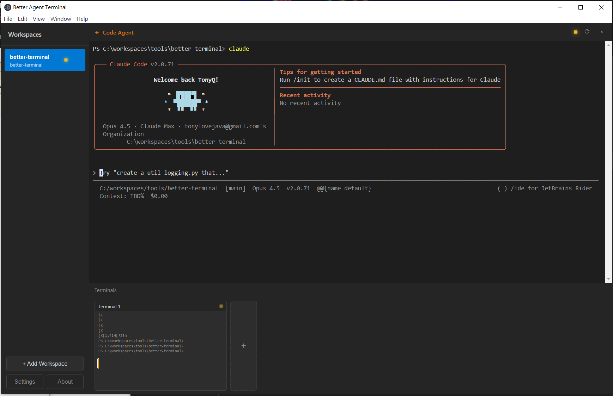

# Better Agent Terminal

<div align="center">


**A Windows terminal aggregator with multi-workspace support and Claude Code integration**

[Download Latest Release](https://github.com/tony1223/better-agent-terminal/releases/latest)

</div>

---

## 📸 Screenshot

<div align="center">

</div>

---

## ✨ Features

- 🖥️ **Multi-Workspace Support** - Organize terminals by project folders
- 🎯 **Google Meet-Style UI** - 70% main panel + 30% thumbnail bar
- ✦ **Claude Code Integration** - Dedicated terminal for AI pair programming
- 💾 **Persistent Sessions** - Terminals keep running when switching views
- 📋 **Easy Copy/Paste** - Ctrl+Shift+C/V or right-click
- 🔄 **Terminal Restart** - Preserves working directory
- 🌐 **UTF-8 Support** - Full Unicode/Chinese character support
- ⚡ **PowerShell Ready** - Automatic ExecutionPolicy Bypass

---

## 📸 UI Layout

```
┌─────────────────────────────────────────────────────────────┐
│  Better Agent Terminal                          [─][□][×]   │
├──────────┬──────────────────────────────────────────────────┤
│          │  ┌────────────────────────────────────────────┐  │
│ Workspace│  │                                            │  │
│ ────────│  │         Main Terminal Panel (70%)          │  │
│          │  │                                            │  │
│ ▶ Work1  │  │  PS C:\project> claude                     │  │
│   Work2  │  │  ╭─────────────────────────────────────╮   │  │
│   Work3  │  │  │ ✦ Claude Code is ready...           │   │  │
│          │  │  ╰─────────────────────────────────────╯   │  │
│          │  │                                            │  │
│          │  └────────────────────────────────────────────┘  │
│          │  ┌──────────────┐ ┌──────────────┐ ┌────────┐   │
│ [+ New]  │  │ Terminal 1   │ │ Terminal 2   │ │   +    │   │
│          │  │ PS> npm run  │ │ PS> git st.. │ │  New   │   │
│          │  └──────────────┘ └──────────────┘ └────────┘   │
└──────────┴──────────────────────────────────────────────────┘
                      Thumbnail Bar (30%)
```

### View Modes

**When Claude Code is focused (default):**
- Main panel: Claude Code terminal
- Thumbnails: All regular terminals + Add button

**When a Terminal is focused:**
- Main panel: Selected terminal
- Thumbnails: Claude Code (always visible for monitoring)

---

## 🚀 Quick Start

### Option 1: Download Release
1. Download `Better.Agent.Terminal-1.0.0-win.zip` from [Releases](https://github.com/tony1223/better-agent-terminal/releases)
2. Extract to any folder
3. Run `Better Agent Terminal.exe`

### Option 2: Build from Source
```bash
# Clone the repository
git clone https://github.com/tony1223/better-agent-terminal.git
cd better-agent-terminal

# Install dependencies
npm install

# Rebuild node-pty for Electron (required for full PTY support)
npx @electron/rebuild -f -w node-pty

# Development mode
npm run compile
npm start

# Build for production
npm run build
```

---

## ⌨️ Keyboard Shortcuts

| Shortcut | Action |
|----------|--------|
| `Ctrl+Shift+C` | Copy selected text |
| `Ctrl+Shift+V` | Paste from clipboard |
| `Right-click` | Copy (if selected) or Paste |

---

## 🏗️ Architecture

```
better-agent-terminal/
├── electron/
│   ├── main.ts          # Electron main process
│   ├── preload.ts       # IPC bridge
│   └── pty-manager.ts   # PTY process management
├── src/
│   ├── components/
│   │   ├── Sidebar.tsx           # Workspace list
│   │   ├── WorkspaceView.tsx     # Main workspace container
│   │   ├── TerminalPanel.tsx     # xterm.js terminal
│   │   ├── ThumbnailBar.tsx      # Thumbnail list
│   │   └── CloseConfirmDialog.tsx
│   ├── stores/
│   │   └── workspace-store.ts    # State management
│   └── styles/
│       └── main.css
└── package.json
```

### Tech Stack
- **Frontend:** React 18 + TypeScript
- **Terminal:** xterm.js + node-pty
- **Framework:** Electron 28
- **Build:** Vite + electron-builder

---

## 🔧 Configuration

Workspaces are automatically saved to:
```
%APPDATA%/better-agent-terminal/workspaces.json
```

---

## 📝 Development

```bash
# Compile TypeScript and bundle
npm run compile

# Start Electron app
npm start

# Build distributable
npm run build
```

---

## 🤝 Contributing

Contributions are welcome! Please feel free to submit a Pull Request.

---

## 📄 License

MIT License - see [LICENSE](LICENSE) for details.

---

## 👨‍💻 Author

**TonyQ** - [@tony1223](https://github.com/tony1223)

Built with assistance from Claude Code 🤖

---

<div align="center">

⭐ Star this repo if you find it useful!

</div>
